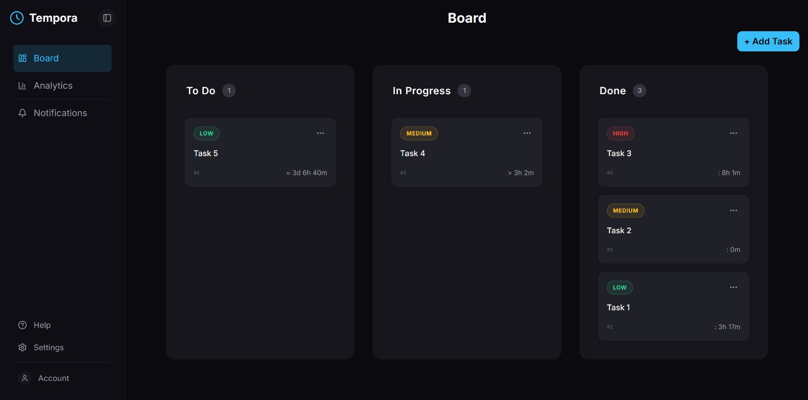
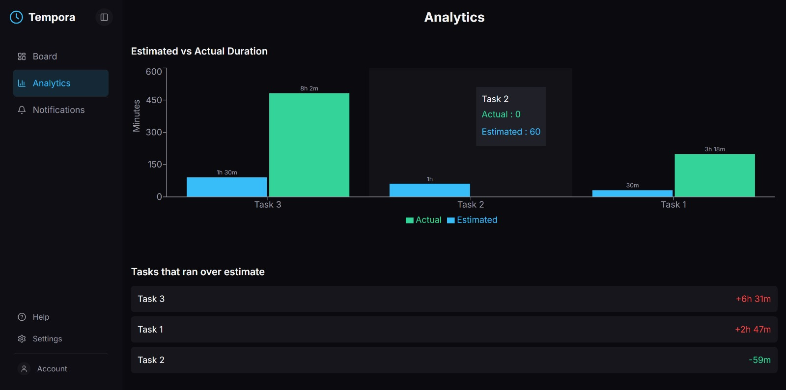

# 📋 Tempora

A full-stack Kanban board that goes beyond task tracking by measuring how long each task actually takes — built with a hand-written Java REST API (no framework), PostgreSQL, and a full CI/CD pipeline.

[**Live Demo**](https://tempora-gray.vercel.app) · [**API**](https://tempora-cmd4.onrender.com)

> The backend runs on Render's free tier and sleeps after 15 minutes of inactivity — the first request can take up to 50 seconds to wake it up. Your data is safe though; it's stored in a managed Postgres database, not on the server itself.

**Status:** v1 almost complete — full CRUD, drag & drop, persistent storage, time-in-column analytics, and CI/CD all live.

---

| Board                                | Analytics                                    |
| ------------------------------------ | -------------------------------------------- |
|  |  |

---

## ✨ What works right now

- Full CRUD REST API with input validation and JUnit 5 tests
- Persistent storage — tasks are saved in PostgreSQL (Neon) and survive server restarts
- Board with three columns (`TODO` / `IN_PROGRESS` / `DONE`), drag & drop between them (dnd-kit), synced to the backend with a `PUT` request
- Create and edit tasks through a modal, with title validation; delete with a confirmation step
- Task priorities (`LOW` / `MEDIUM` / `HIGH`) with color-coded badges
- **Time-in-column analytics** — set an estimated duration on a task, watch a live counter while it's `IN_PROGRESS`, and see the actual time frozen once it's `DONE`. An analytics page compares estimated vs. actual time per task and highlights the ones that ran over or finished early.
- Full status-change history stored per task (`GET /tasks/{id}/history`) — the backend logs every transition, so time can't be hidden by moving a task back and forth
- Collapsible sidebar navigation, dark/light mode, responsive layout with touch-friendly drag & drop
- Loading and error states throughout
- CI on every pull request, and automatic deploys on merge

---

## 🛠 Tech

**Backend:** Java 17, Maven, JDK built-in `HttpServer`, Gson, JUnit 5, PostgreSQL with raw JDBC (no ORM).

**Frontend:** React, TypeScript, Vite, Tailwind CSS v4, react-router-dom, dnd-kit, Recharts, lucide-react.

**Infra:** Docker (backend), Render (backend hosting), Neon (managed PostgreSQL), Vercel (frontend hosting), GitHub Actions (CI).

---

## 🔌 API

| Method   | Path                  | Behavior                                                                      |
| :------- | :-------------------- | :---------------------------------------------------------------------------- |
| `GET`    | `/tasks`              | All tasks, including duration fields (200)                                    |
| `POST`   | `/tasks`              | Create a task (201), empty title -> 400, status defaults to `TODO`            |
| `GET`    | `/tasks/{id}`         | One task (200) or 404                                                         |
| `PUT`    | `/tasks/{id}`         | Partial update - only the sent fields are changed (200) or 404                |
| `DELETE` | `/tasks/{id}`         | Delete (204) or 404                                                           |
| `GET`    | `/tasks/{id}/history` | Full status-change history for a task (`fromStatus`, `toStatus`, `changedAt`) |

CORS is whitelist-based — local dev origins and the deployed frontend are allowed, everything else is blocked.

---

## 🚀 Running it locally

Backend (needs Java 17+, Maven, and a local PostgreSQL database):

```bash
cd backend
mvn compile exec:java
```

The backend reads its database connection from environment variables (`DB_URL`, `DB_USERNAME`, `DB_PASSWORD`), so nothing sensitive is committed. The schema is created automatically on startup — no manual SQL setup needed.

Frontend (needs Node.js):

```bash
cd frontend
npm install
npm run dev
```

The frontend reads the API address from `VITE_API_URL`. For local development, create `frontend/.env.local`:

```
VITE_API_URL=http://localhost:8080
```

Both need to run at the same time. Tests: `mvn test` in the backend folder.

---

## ⚙️ CI/CD

- **Backend CI** runs `mvn test` on every pull request
- **Frontend CI** runs `npm run build` to catch TypeScript and build errors before merge
- Both workflows use `dorny/paths-filter` so unrelated changes skip the actual steps but still report a result — otherwise a required check would sit pending forever on a PR that doesn't touch that side
- `main` is protected: pull request required, both checks must pass, squash-merge only
- Merging to `main` triggers an automatic redeploy on Vercel and Render

---

## 🧠 Some decisions I made

- **No framework on purpose.** My browser blocked my own frontend and that's how I actually learned what CORS is - I wrote a whitelist filter for it instead of allowing `*`.
- **`PUT` does partial updates.** Drag & drop only needs to change `status`, so sending the whole object felt wrong. Only the fields you send get updated. I later learned this behavior is actually closer to what `PATCH` is for - noted for a future refactor.
- **PostgreSQL over SQLite.** SQLite was my first plan — simpler, no server to run. But since the backend is deployed on Render's free tier, where the filesystem isn't persistent, a SQLite file would be wiped on every restart. So I went with PostgreSQL from the start of the persistence work. The SQL I wanted to learn is the same either way.
- **Raw JDBC, no ORM.** I wanted to write the SQL myself and understand what's happening, instead of letting a tool like Hibernate hide it.
- **Separate dev and prod databases.** Local development uses my own Postgres; production uses a managed database (Neon), so test data I add locally never mixes with what's live.
- **`VARCHAR + CHECK` instead of native enums** for priority and status, so adding a new value later (like `ARCHIVED`) is easier than altering a native enum type.
- **The server never trusts the client for durations.** The frontend only ever sends a status change — the backend calculates and stores actual time spent. Otherwise someone could just send a fake duration through Postman.
- **A schema drift bug taught me to think about migrations.** When I added the duration columns, `CREATE TABLE IF NOT EXISTS` silently did nothing on production, since the table already existed — the new columns never got created there, and the API started failing with 500s. Now every new column gets both the `CREATE TABLE` definition and a matching `ALTER TABLE ... ADD COLUMN IF NOT EXISTS`, so existing databases stay in sync too.
- **Docker for the backend.** Render doesn't support plain Java, so I wrote a Dockerfile to build and run it - not something I planned, just what deploying actually required.
- **One modal for create and edit.** The forms were identical, so a single `editingTaskId` state decides whether submitting sends a `POST` or a `PUT`.

---

## 🗺️ Roadmap

- A task history view in the UI (the `/history` endpoint already exists, just not wired up to a screen yet)
- A proper testing strategy for the database layer (the manager tests became integration tests once persistence was added, and are currently disabled)
- Splitting backend classes into subpackages (`model`, `handler`, `db`, `filter`) as the codebase grows
- Authentication and multi-user boards (right now the board is shared — everyone sees the same tasks)
- Spring Boot version of the backend, to compare against this one

---

### 👩🏼‍💻 Author

**Ezgi Nur Yiğit** · Software Development Student

> Built as a personal challenge right after finishing my 1st year (Summer 2026).
